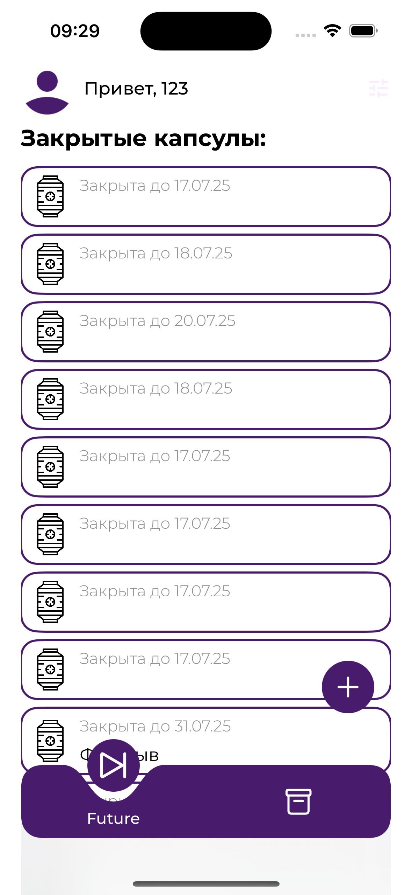

# TimeCapsule

**TimeCapsule** — это концептуальное iOS-приложение, в котором каждый может оставить послание самому себе в будущем. Идея приложения вдохновлена желанием сохранить воспоминания, эмоции и важные мысли, чтобы в будущем вернуться к ним и вновь пережить те моменты.

## Описание

Каждый из нас хотя бы раз хотел пообщаться с собой в будущем. **TimeCapsule** позволяет создать такую возможность: пользователь может отправить себе капсулу времени — сообщение, которое откроется позже. Проект стремится вызвать ощущение ностальгии и погружения в детство через визуал и атмосферу.

На текущем этапе реализован базовый функционал:
- Регистрация и авторизация через Firebase.
- Возможность создавать капсулы и сохранять их в Firestore.
- Кастомный TabBar с визуальной анимацией переключения между разделами.

## Скриншоты

  

## Технологии

- SwiftUI
- Firebase Authentication
- Firebase Firestore
- Custom TabBar с анимацией
- Архитектура MVVM

## Что планируется

- Открытие капсул в назначенное время.
- Визуальные и звуковые эффекты, создающие атмосферу детства.
- Возможность добавления фото, аудио или видео к капсуле.
- Система напоминаний о вскрытии капсул.
- Расширенный онбординг и персонализация.

---

Разработка продолжается. Цель проекта — создать не просто приложение, а эмоциональный опыт, который позволит пользователю по-настоящему пообщаться с собой — будущим.
